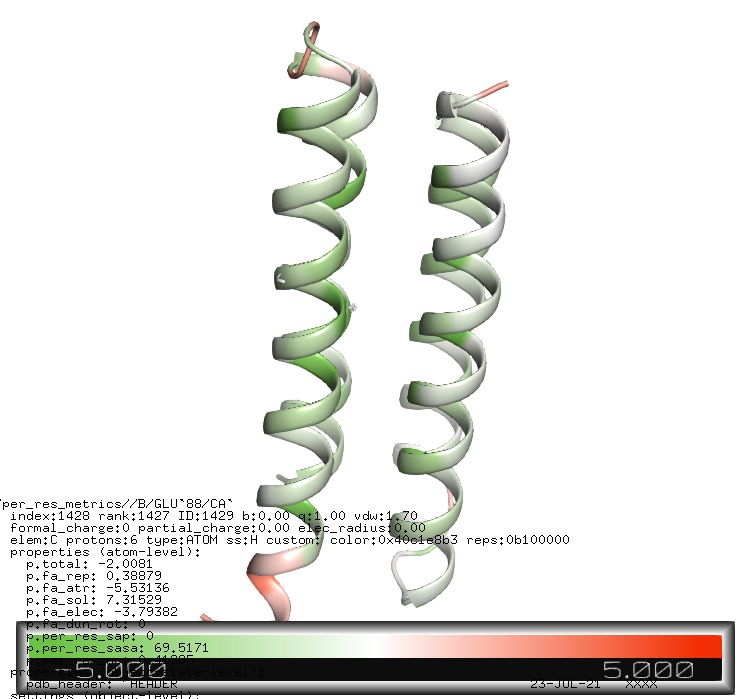

# rosetta_pymol_utils
Helpful visualization in pymol for PDBs written by Rosetta.

Highlights include:
* load PDBInfoLabels into pymol selections
* load and highlight atoms from UnsatHbonds filter
* load per residue score terms into corresponding pymol custom fields (e.g. `p.total`) and color by them
* load per residue simple metrics and color

## Usage example

In pymol do
```python
cd /path/to/repo
run pymol_utils.py
#load the pdb with all metrics
load_rosetta_pdb('example\per_res_metrics.pdb', per_res_metrics='per_res_sap per_res_sasa per_res_nc')
#color by total score
color_by_score total, range=-5 0 5, colors=green white red
```

